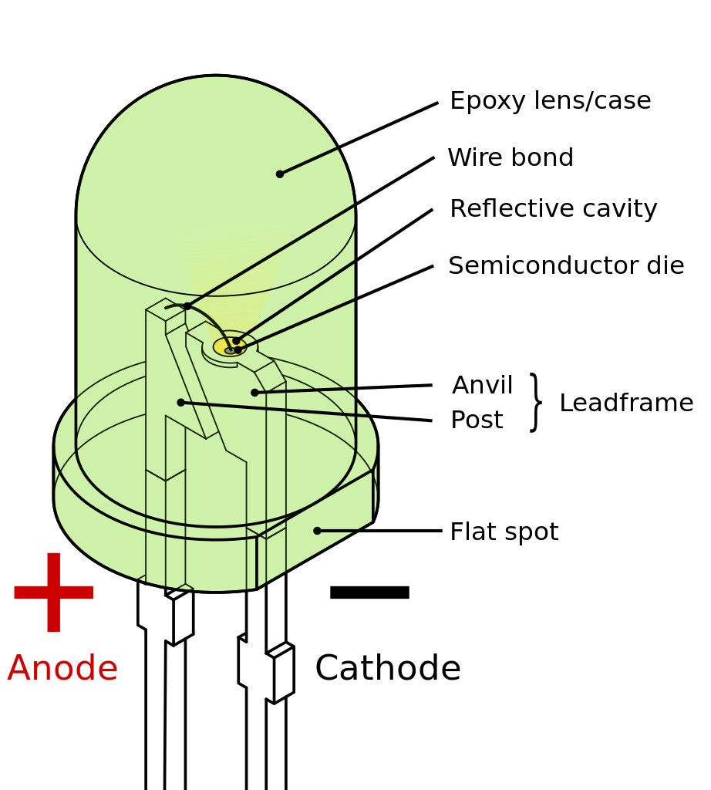

## Read the Objectives

In this lab, you will learn the basics of Digital GPIO.

By the end of this module, you should be able to use the MRAA library to do the following:

* Write the Blink LED program using Digital GPIO output.
* Use Digital GPIO input to read the state of a Grove Button.
* Combine Digital GPIO input and output into a single program.

## Digital GPIO Output: LED blink Project

### Hardware Setup

Sensor | Pin
--- | ---
Grove LED | D3

:arrow_forward: Set up the LED for the Grove Shield.

Find the LED module and plug in an LED. Make sure that the cathode is plugged into the negative (-) socket. You can tell the cathode of an LED by the flat side of the led case, or by the larger “anvil” inside the LED. Refer to the diagram below:



:arrow_forward: Plug in the module into the D3 socket on the sensor shield:

### Digital GPIO Write Software - Blink LED

Programs in the Arduino Create environment can be build using the Arduino APIs or MRAA APIs.  In fact, the Arduino Create development team has implemented the Arduino APIs on top of the MRAA APIs. So when compiling a program written using the Arduino APIs on an Intel platform, you are actually using both sets of APIs.

### Arduino Version of Blink LED
```c
// A 512 offset is required for sub-platforms.
// 515 corresponds to digital pin 3, or D3.
#define SUBPLATFORM_OFFSET 512
#define PIN SUBPLATFORM_OFFSET + 3

// the setup function runs once when you start your sketch
void setup() {
  //add the Grove Pi+ sub-platform
  mraa_add_subplatform(MRAA_GROVEPI, "0");
  // initialize digital pin LED_BUILTIN as an output.
  pinMode(PIN, OUTPUT);
}

// the loop function runs over and over again forever
void loop() {
  digitalWrite(PIN, HIGH);   // turn the LED on (HIGH)
  delay(1000);               // wait for a second
  digitalWrite(PIN, LOW);    // turn the LED off (LOW)
  delay(1000);               // wait for a second
}

```
### Build and Run your Digital GPIO Read Program

 Build and run your program

You should now see the LED blinking once a second. If the LED doesn’t appear to be blinking or is blinking very dimly turn the potentiometer counter-clockwise:


### MRAA Version of Blink LED

```c
#include <stdio.h>
#include <unistd.h>
#include <errno.h>
#include <signal.h>
#include <stdlib.h>

#include "mraa.h"

#define PLATFORM_OFFSET 512
#define DEFAULT_IOPIN 3 + PLATFORM_OFFSET

int running = 0;
static int iopin;

void
sig_handler(int signo)
{
    if (signo == SIGINT) {
        printf("closing IO%d nicely\n", iopin);
        running = -1;
    }
}

int
main()
{
    mraa_add_subplatform(MRAA_GROVEPI, "0");
    mraa_result_t r = MRAA_SUCCESS;
    iopin = DEFAULT_IOPIN;

    mraa_init();
    fprintf(stdout, "MRAA Version: %s\nStarting Blinking on IO%d\n", mraa_get_version(), iopin);

    mraa_gpio_context gpio;
    gpio = mraa_gpio_init(iopin);
    if (gpio == NULL) {
        fprintf(stderr, "Are you sure that pin%d you requested is valid on your platform?", iopin);
        exit(1);
    }
    printf("Initialised pin%d\n", iopin);

    // set direction to OUT
    r = mraa_gpio_dir(gpio, MRAA_GPIO_OUT);
    if (r != MRAA_SUCCESS) {
        mraa_result_print(r);
    }

    signal(SIGINT, sig_handler);

    while (running == 0) {
        r = mraa_gpio_write(gpio, 0);
        if (r != MRAA_SUCCESS) {
            mraa_result_print(r);
        } else {
            printf("off\n");
        }

        sleep(1);

        r = mraa_gpio_write(gpio, 1);
        if (r != MRAA_SUCCESS) {
            mraa_result_print(r);
        } else {
            printf("on\n");
        }

        sleep(1);
    }

    r = mraa_gpio_close(gpio);
    if (r != MRAA_SUCCESS) {
        mraa_result_print(r);
    }

    return r;
}
```

### Digital GPIO Input - Read the State of a Button

Programs in the Arduino Create environment can be build using the Arduino APIs or MRAA APIs.  In fact, the Arduino Create development team has implemented the Arduino APIs on top of the MRAA APIs. So when compiling a program written using the Arduino APIs on an Intel platform, you are actually using both sets of APIs.


#### Using the Arduino APIs

 Begin by creating a new project

The one addition to this nearly standard Arduino code is the **mraa_add_subplatform** call, which declares which shield is being used.

```c
// PIN is defined to D3
#define PLATFORM_OFFSET 512
#define PIN 3 + PLATFORM_OFFSET

// the setup routine runs once when you press reset:
void setup() {
  mraa_add_subplatform(MRAA_GROVEPI, "0");
  // initialize serial communication at 9600 bits per second:
  DebugSerial.begin(115200);
  // make the pushbutton's pin an input:
  pinMode(PIN, INPUT);
}

// the loop routine runs over and over again forever:
void loop() {
  // read the input pin:
  int buttonState = digitalRead(PIN);
  // print out the state of the button:
  DebugSerial.println(buttonState);
  delay(1);        // delay in between reads for stability
}
```

#### Using the MRAA APIs

 Begin by creating a new project

 In the main C file, add these header files.

```c
#include "stdio.h"
#include "unistd.h"
#include <signal.h>

#include "mraa.h"
```

:arrow_forward: Next declare a couple of CONSTANTS and variables. **Note that to reference the GPIOs on the GrovePI Shield, you must use a 512 offset**.
```c
#define PLATFORM_OFFSET 512
#define PIN 3 + PLATFORM_OFFSET

int running = 0;
```
:arrow_forward: Now declare a signal handler function to gracefully quit the main loop

```c
void
sig_handler(int signo)
{
    if (signo == SIGINT) {
        printf("closing down nicely\n");
        running = -1;
    }
}
```

Declare the subplatform to be MRAA_GrovePI. This identifies to the MRAA libary which shield is being used with this project.

Declare a GPIO pin, set it to input mode and enter a while loop to read its value.
```c
int
main(void)
{
    mraa_add_subplatform(MRAA_GROVEPI, "0");
    mraa_result_t r = MRAA_SUCCESS;

    mraa_init();
    fprintf(
      stdout, 
      "MRAA Version: %s\nStarting Read on D3 (Ctrl+C to exit)\n", 
      mraa_get_version()
    );

    //! [Interesting]
    mraa_gpio_context gpio;

    gpio = mraa_gpio_init(PIN);

    mraa_gpio_dir(gpio, MRAA_GPIO_IN);

    signal(SIGINT, sig_handler);

    while (running == 0) {
        fprintf(
          stdout, 
          "Gpio is %d\n", 
          mraa_gpio_read(gpio)
        );
        sleep(1);
    }

    r = mraa_gpio_close(gpio);
    //! [Interesting]
    if (r != MRAA_SUCCESS) {
        mraa_result_print(r);
    }

    return r;
}
```

## Sensors and Actuators APIs - UPM API Doxygen Reference

*   [C++ Sensor/Actuator API libmraa (v1.5.1) and UPM (v1.0.2)](https://iotdk.intel.com/docs/master/upm/)
*   [Java Sensor/Actuator API libmraa (v1.5.1) and UPM (v1.0.2)](https://iotdk.intel.com/docs/master/upm/java/)
*   [Python Sensor/Actuator API libmraa (v1.5.1) and UPM (v1.0.2)](https://iotdk.intel.com/docs/master/upm/python/)
*   [NodeJS Sensor/Actuator API libmraa (v1.5.1) and UPM (v1.0.2)](https://iotdk.intel.com/docs/master/upm/node/)

### Grove Temperature Sensor

*   [Seeed Studio Wiki: Grove Temperature Sensor](http://www.seeedstudio.com/wiki/Grove_-_Temperature_Sensor_V1.2)
*   [UPM API - GroveTemp](http://iotdk.intel.com/docs/master/upm/node/classes/grovetemp.html#methods)
*   [UPM C++ example: Grove Temperature Sensor](https://github.com/intel-iot-devkit/upm/blob/master/examples/c%2B%2B/grovetemp.cxx)
*   [UPM JavaScript example: Grove Temperature Sensor](https://github.com/intel-iot-devkit/upm/blob/master/examples/javascript/grovetemp.js)

### Grove LCD RGB Backlight

*   [Seeed Studio Wiki: LCD RGB Backlight](http://www.seeedstudio.com/wiki/Grove_-_LCD_RGB_Backlight)
*   [UPM API - i2clcd](http://iotdk.intel.com/docs/master/upm/node/classes/lcd.html#methods)
*   [UPM API Doxygen - Jhd1313m1](http://iotdk.intel.com/docs/master/upm/node/classes/jhd1313m1.html#methods)
*   [UPM API - Jhd1313m1](https://github.com/intel-iot-devkit/upm/blob/master/examples/c%2B%2B/jhd1313m1-lcd.cxx)
*   [C++ example: RGB LCD](https://github.com/intel-iot-devkit/upm/blob/master/examples/javascript/jhd1313m1-lcd.js)

### Grove Button

*   [UPM JavaScript example: Grove Button](https://github.com/intel-iot-devkit/upm/blob/master/examples/javascript/grovebutton.js)
*   [Seeed Studio Wiki: Grove Button](http://www.seeedstudio.com/wiki/Grove_-_Button)
