## Read the Objectives

To learn how to build stand alone IoT devices with UP Squared board*. Learn to use sensors and actuators to gather and respond to data. The devices built during this lab will be extended in later labs to send their data to the Intel® IoT Gateway and to the cloud

By the end of this module, you should be able to:

*   Connect Grove* IoT Commercial Developer Kit sensors and actuators to your Up Squared.

*   Use the C UPM libraries to control actuators and read data from sensors.

## Deploy Your First App to the Intel® IoT Gateway

### Create a LED blink project

Go to (create-intel.arduino.cc) and log in to your account or create a new account.
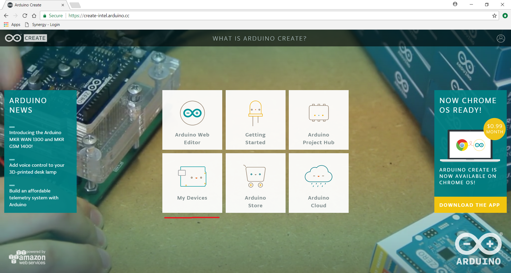

Click on My Devices to set up the UP Squared board.
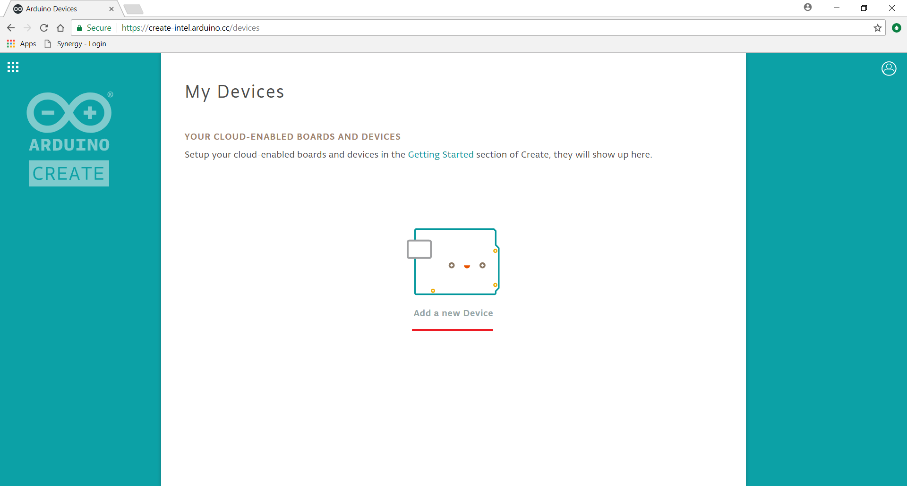

Click on Set up a generic Intel® IoT Platform.
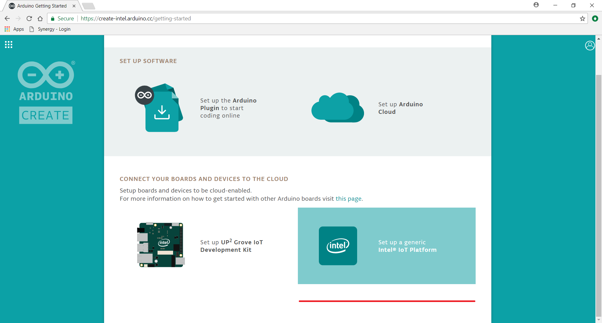
:Note the Set up UP2 Grove IoT Development Kit button is still in Development and is not reliable to connect to the Up Squared board.

 Follow the instructions to set up the UP Squared board and click My device is ready.
 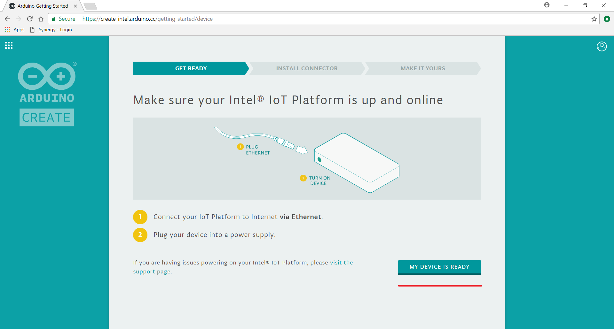

 The UP Squared was preloaded with UBlinux. Click on option 1 I have already installed the an OS on my device.
 

Click on option A I know my Intel IoT Platform IP ADDRESS.
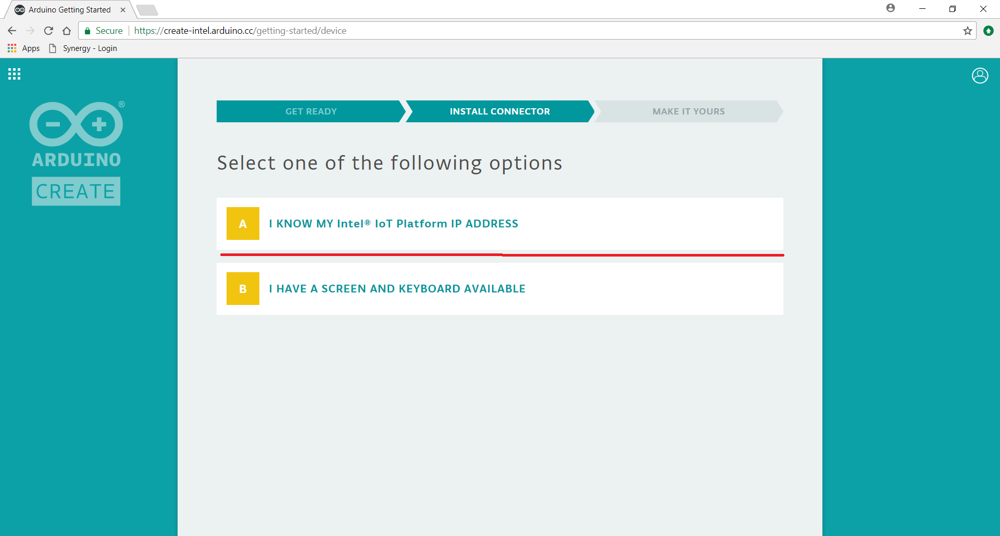

Enter the IP ADDRESS that is shown on the LCD screen and click NEXT.
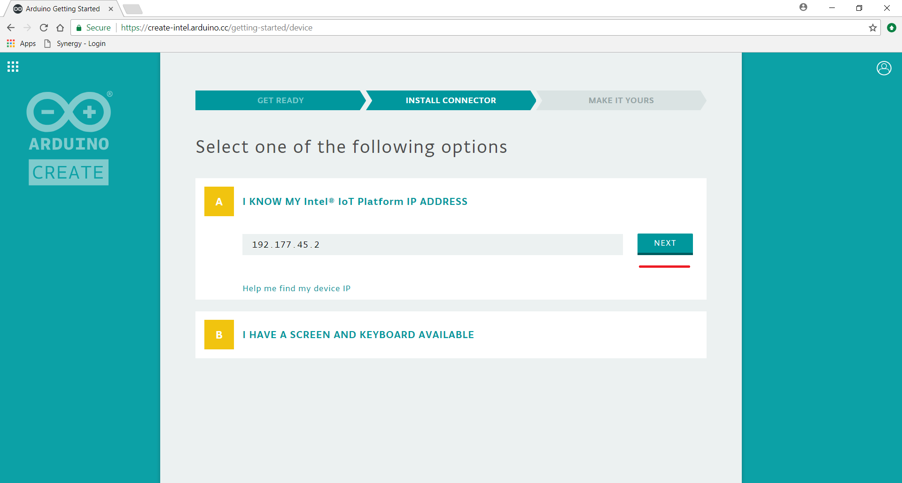

Enter in the username "nuc-user" and password "root" for the UP Squared board and click DONE.
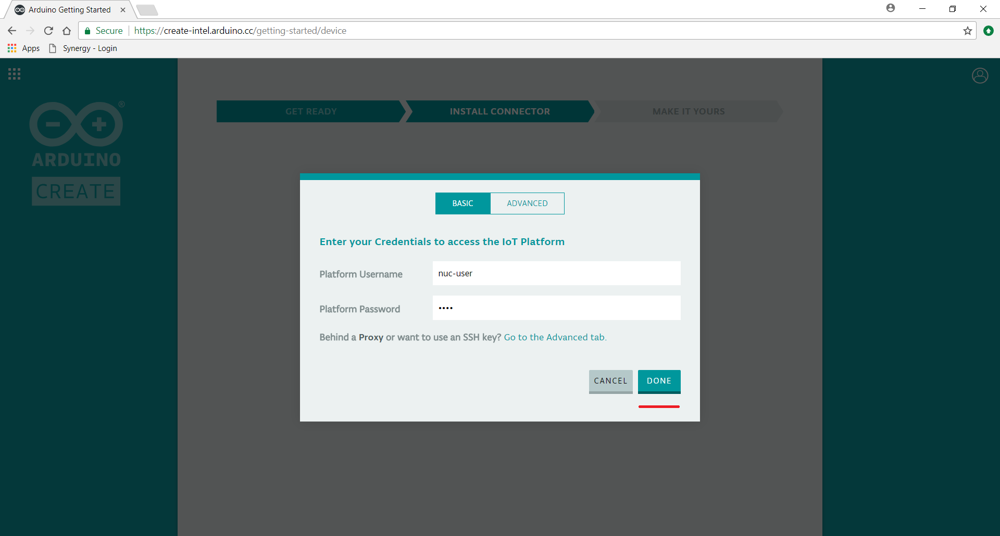

Connecting to device.
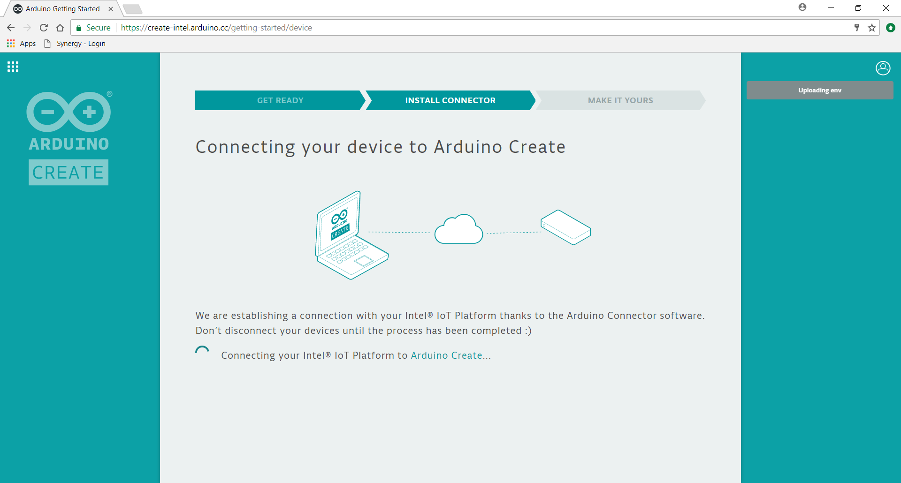

Enter a name for your device and click SAVE.
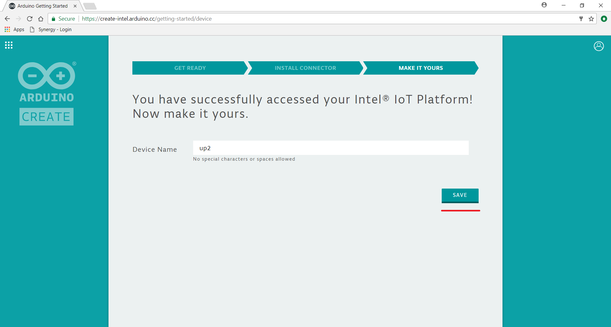

You have successfully connected the UP Squared board to Arduino-Create. Click on GO TO MY DEVICES.
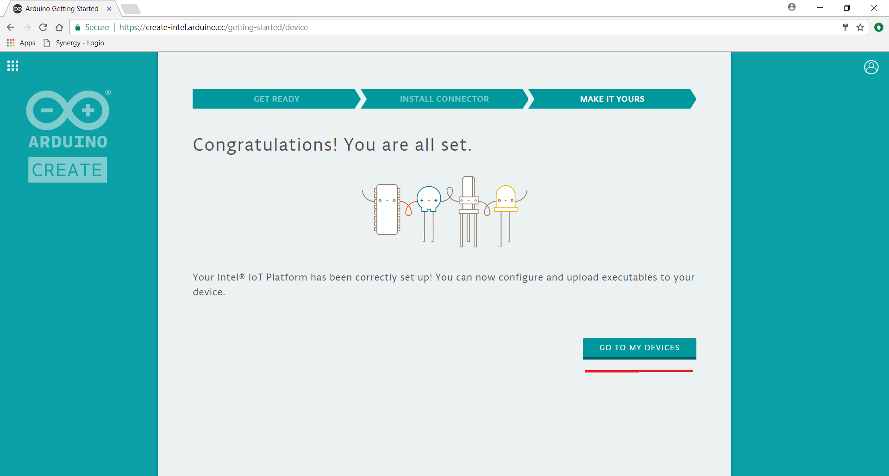

Click on the squares in the upper left corner.
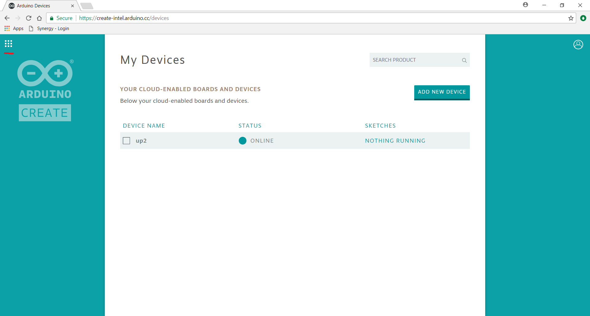

Click on Arduino Web Editor.


Set up the LED for the Grove Shield.
Find the LED module and plug in an LED. Make sure that the cathode is plugged into the negative (-) socket. You can tell the cathode of an LED by the flat side of the led case, or by the larger “anvil” inside the LED. Refer to the diagram below:


Once the LED is in the socket plug in the module into the D4 socket on the sensor shield:

 Click on drop down menu on the sketch_monthDaya and select Rename Sketch.*
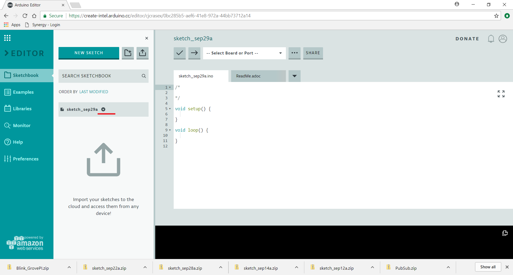

 Rename the sketch to **blinky-LED** and click OK. Now we will write the LED blink program to it.
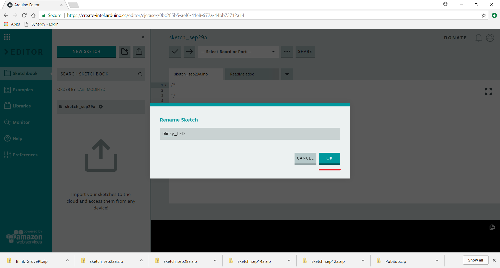

### Write LED blink program
Delete the void setup() and void loop() functions in the sketch to create a blank sketch. Select the up2 via cloud board under -- Select Board or Port --
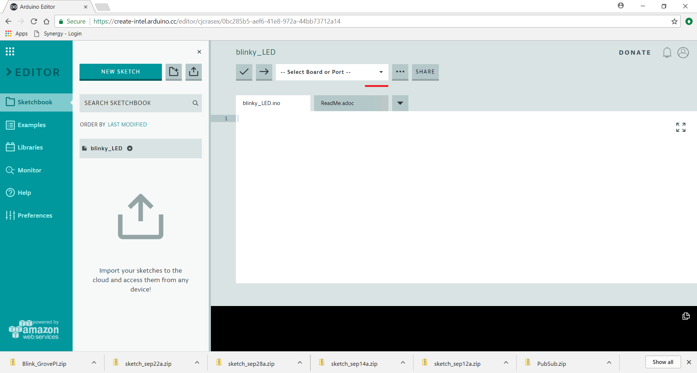

Update **blinky-LED** with following changes

1.  Include the following C headers in your program

    ```c
    #include <stdio.h>
    #include <unistd.h>
    #include <errno.h>
    #include <signal.h>
    #include <stdlib.h>

    #include "mraa.h"
    ```

2.  Create the default LED GPIO pin macro. Here the pin value is 13\.

    ``` c
    #define DEFAULT_IOPIN 13 //LED GPIO pin 13

    ```

3.  Write the signal handler function to handle termination of the program which will continuously toggle the LED

    ```c
    void sig_handler(int signo)
    {
        if (signo == SIGINT) {
            printf("closing IO%d nicely\n", iopin);
            running = -1;
        }
    }
    ```

4.  In the main function of the program first initialize mraa then initialize the gpio pin and finally set the direction for the pin (MRAA_GPIO_OUT in our case)

5.  Finally write a while loop that will continuously write a 1 & 0 to the LED at periodic intervals for it to blink

6.  The final code should look like the below one:

    ``` c
    #include <stdio.h>
    #include <unistd.h>
    #include <errno.h>
    #include <signal.h>
    #include <stdlib.h>

    #include "mraa.h"


    #define DEFAULT_IOPIN 13

    int running = 0;
    static int iopin;

    void
    sig_handler(int signo)
    {
        if (signo == SIGINT) {
            printf("closing IO%d nicely\n", iopin);
            running = -1;
        }
    }

    int main(void)

    {
        mraa_result_t r = MRAA_SUCCESS;
        iopin = DEFAULT_IOPIN;

        mraa_init();
        fprintf(stdout, "MRAA Version: %s\nStarting Blinking on IO%d\n", mraa_get_version(), iopin);

        mraa_gpio_context gpio;
        gpio = mraa_gpio_init(iopin);
        if (gpio == NULL) {
            fprintf(stderr, "Are you sure that pin%d you requested is valid on your platform?", iopin);
            exit(1);
        }
        printf("Initialised pin%d\n", iopin);

        // set direction to OUT
        r = mraa_gpio_dir(gpio, MRAA_GPIO_OUT);
        if (r != MRAA_SUCCESS) {
            mraa_result_print(r);
        }

        signal(SIGINT, sig_handler);

        while (running == 0) {
            r = mraa_gpio_write(gpio, 0);
            if (r != MRAA_SUCCESS) {
                mraa_result_print(r);
            } else {
                printf("off\n");
            }

            sleep(1);

            r = mraa_gpio_write(gpio, 1);
            if (r != MRAA_SUCCESS) {
                mraa_result_print(r);
            } else {
                printf("on\n");
            }

            sleep(1);
        }

        r = mraa_gpio_close(gpio);
        if (r != MRAA_SUCCESS) {
            mraa_result_print(r);
        }

        return r;
    }
    ```
### Disable Node-Red service

** If Node-Red is enabled on your Up2 Board then please be sure to disable the Node-Red service running on your Gateway!**

*   The IP address that you see on the LCD screen is a Node-Red flow running on boot, since Node-Red uses the device resources through ttyACM0 node it is required to stop it before we run our C programs

*   Open a ssh terminal to your Gateway and give following command:

    `sudo systemctl stop node-red-experience`

*   Check that service has stopped

    `sudo systemctl status node-red-experience`

## Build and Run your LED blink program

Click the check mark to compile/verify the program.


Click the arrow to upload the sketch to the UP Squared board
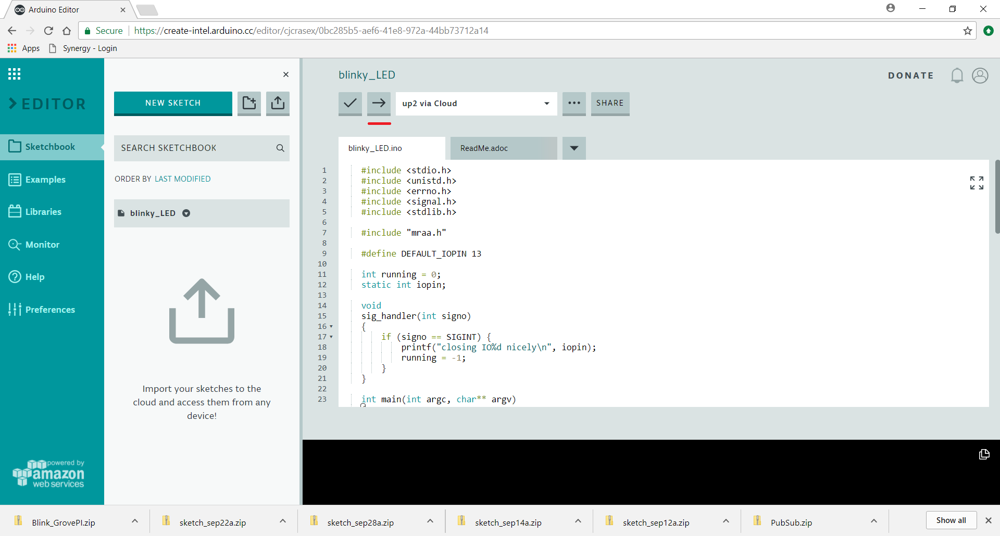

You should now see the LED blinking once a second. If the LED doesn’t appear to be blinking or is blinking very dimly turn the potentiometer counter-clockwise:


You should see successful upload at the bottom of the screen.
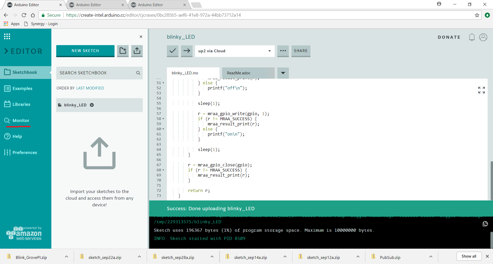

Click on the Monitor button to the left.

You should see on/off being sent back from the UP Squared

## Setup the temperature sensor and LCD screen

### Plug into the Grove shield, temperature sensor


 Write code in C and measure temperature in Celsius using upm library, convert it to Fahrenheit, then display it on the LCD.

Connect **Grove Temperature Sensor** to analog pin **A0** of the Grove Base Shield.

## Create a temperature sensor project
Click on the NEW SKETCH button


Rename the sketch to temperature and delete the void setup() and void loop() functions like before to create and empty sketch.
 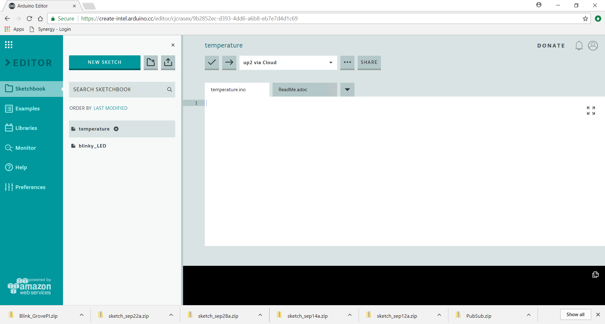

## Write the Code to Read the Temperature Sensor.

Update <span class="icon file">temperature</span> to read the temperature sensor on program start up and log it to the console.

1.  Include the following headers in your C program

  	```c
	#include <stdio.h>
	#include <stdlib.h>

    #include "jhd1313m1.h"
    #include "temperature.h"
    #include "upm.h"
    #include "upm_utilities.h"
    #include "signal.h"
    #include "string.h"
    ```

2.  Write the signal handler function to handle termination of the program which will continuously read and display temperature

	```c
    void sig_handler(int signo)
    {
        if (signo == SIGINT) {
            printf("closing IO%d nicely\n", iopin);
            running = -1;
        }
    }
	```

3.  Make sure to initialize LCD and Temperature modules using the right library calls. I2C it is bus 0 and for temperature sensor it is pin A0.

    ```c
    jhd1313m1_context lcd = jhd1313m1_init(0, 0x3e, 0x62);
    temperature_context temp = temperature_init(0);

4.  Finally create a while loop that will continuously read the temperature value from sensor in celsius, convert it to fahrenheit and then display this on LCD by setting the cursor position and then writing the string. Also you can continuously change the LCD display color as done in the code.

5.  The final code should look like this:

    ``` c
    #include <stdio.h>
    #include <stdlib.h>

    #include "jhd1313m1.h"
    #include "temperature.h"
    #include "upm.h"
    #include "upm_utilities.h"
    #include "signal.h"
    #include "string.h"

    bool shouldRun = true;

    void sig_handler(int signo)
    {
        if (signo == SIGINT)
            shouldRun = false;
    }


    int main()
    {
        signal(SIGINT, sig_handler);
        int fahrenheit;
        float celsius;
        //! [Interesting]
        // initialize a JHD1313m1 on I2C bus 0, LCD address 0x3e, RGB
        // address 0x62

        jhd1313m1_context lcd = jhd1313m1_init(0, 0x3e, 0x62);
        temperature_context temp = temperature_init(0);

        if (!lcd)
        {
            printf("jhd1313m1_i2c_init() failed\n");
            return 1;
        }

        int ndx = 0;
        char str1[20];
        char str2[20];
        uint8_t rgb[7][3] = {
            {0xd1, 0x00, 0x00},
            {0xff, 0x66, 0x22},
            {0xff, 0xda, 0x21},
            {0x33, 0xdd, 0x00},
            {0x11, 0x33, 0xcc},
            {0x22, 0x00, 0x66},
            {0x33, 0x00, 0x44}};


        while (shouldRun)
        {
            temperature_get_value(temp, &celsius);
            celsius = celsius * 0.6; //Arduino factor for 5V
            fahrenheit = (int) (celsius * 9.0/5.0 + 32.0);
            printf("%d degrees Celsius, or %d degrees Fahrenheit\n",
                    (int)celsius, fahrenheit);

            snprintf(str1, sizeof(str1), "Temperature: ");
            snprintf(str2, sizeof(str2), "F: %d & C: %d", fahrenheit, (int)celsius);
            // Alternate rows on the LCD
            jhd1313m1_set_cursor(lcd, 0, 0);
            jhd1313m1_write(lcd, str1, strlen(str1));
            jhd1313m1_set_cursor(lcd, 1, 0);
            jhd1313m1_write(lcd, str2, strlen(str2));
            // Change the color
            uint8_t r = rgb[ndx%7][0];
            uint8_t g = rgb[ndx%7][1];
            uint8_t b = rgb[ndx%7][2];
            ndx++;
            jhd1313m1_set_color(lcd, r, g, b);

            upm_delay(1);
        }
        temperature_close(temp);

        return 0;
	}
    ```
## Build and Upload your program
Click on the arrow again to upload the sketch.
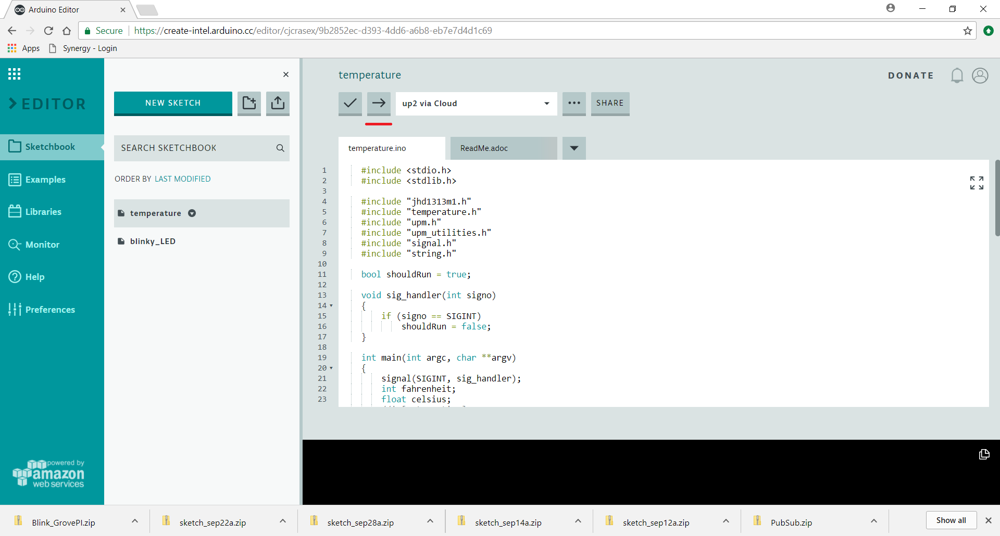

You should see the temperature value on your LCD in both celsius and Fahrenheit.

There are a number of additional examples available for reference as [how-to-code-samples](https://github.com/intel-iot-devkit/how-to-code-samples) on git hub

## Additional resources

Information, community forums, articles, tutorials and more can be found at the [Intel Developer Zone](https://software.intel.com/iot).

For reference code for any sensor/actuator from the Grove* IoT Commercial Developer Kit, visit [https://software.intel.com/en-us/iot/hardware/sensors](https://software.intel.com/en-us/iot/hardware/sensors)

#### Sensors and Actuators APIs - UPM API Doxygen Reference

*   [C++ Sensor/Actuator API libmraa (v1.5.1) and UPM (v1.0.2)](https://iotdk.intel.com/docs/master/upm/)
*   [Java Sensor/Actuator API libmraa (v1.5.1) and UPM (v1.0.2)](https://iotdk.intel.com/docs/master/upm/java/)
*   [Python Sensor/Actuator API libmraa (v1.5.1) and UPM (v1.0.2)](https://iotdk.intel.com/docs/master/upm/python/)
*   [NodeJS Sensor/Actuator API libmraa (v1.5.1) and UPM (v1.0.2)](https://iotdk.intel.com/docs/master/upm/node/)

#### Grove Temperature Sensor

*   [Seeed Studio Wiki: Grove Temperature Sensor](http://www.seeedstudio.com/wiki/Grove_-_Temperature_Sensor_V1.2)
*   [UPM API - GroveTemp](http://iotdk.intel.com/docs/master/upm/node/classes/grovetemp.html#methods)
*   [UPM C++ example: Grove Temperature Sensor](https://github.com/intel-iot-devkit/upm/blob/master/examples/c%2B%2B/grovetemp.cxx)
*   [UPM JavaScript example: Grove Temperature Sensor](https://github.com/intel-iot-devkit/upm/blob/master/examples/javascript/grovetemp.js)

#### Grove LCD RGB Backlight

*   [Seeed Studio Wiki: LCD RGB Backlight](http://www.seeedstudio.com/wiki/Grove_-_LCD_RGB_Backlight)
*   [UPM API - i2clcd](http://iotdk.intel.com/docs/master/upm/node/classes/lcd.html#methods)
*   [UPM API Doxygen - Jhd1313m1](http://iotdk.intel.com/docs/master/upm/node/classes/jhd1313m1.html#methods)
*   [UPM API - Jhd1313m1](https://github.com/intel-iot-devkit/upm/blob/master/examples/c%2B%2B/jhd1313m1-lcd.cxx)
*   [C++ example: RGB LCD](https://github.com/intel-iot-devkit/upm/blob/master/examples/javascript/jhd1313m1-lcd.js)

#### Grove Button

*   [UPM JavaScript example: Grove Button](https://github.com/intel-iot-devkit/upm/blob/master/examples/javascript/grovebutton.js)
*   [Seeed Studio Wiki: Grove Button](http://www.seeedstudio.com/wiki/Grove_-_Button)
