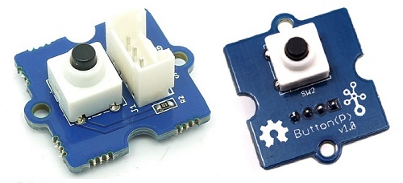
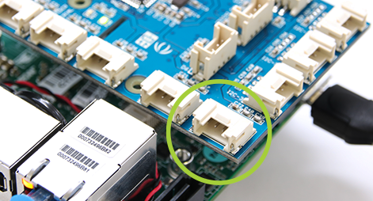

# Introduction to Digital GPIO

The lab guides you through the creation of programs.

1. A digital input GPIO program using the Arduino APIs.
2. A digital output GPIO program using the Arduino APIs.
3. A digital input GPIO program using the MRAA APIs.
4. A digital output GPIO program using the MRAA APIs.

## MRAA API vs. Arduino API

Both the MRAA and Arduino APIs are available in the Arduino Create environment and you can choose which to use, but why are there two APIs to program sensors and actuators? To answer this let's list of the pros and cons of using each set of APIs?

The Arduino APIs are simple, widely used by developers and the Arduino Development environment will let the developer use them on any Arduino board. Sounds pretty good. However, if you would like the program to be portable to Raspberry Pi or Intel NUC, or if you needs access to low level APIs calls while maintaining that portability then the MRAA APIs are useful. In a later lab we will demonstrate the UPM APIs which are both portable and high level.

Lastly, when you are using the Arduino Create environment with an Intel IoT board, you should know that the Arduino APIs are actually rewritten using the MRAA API. The Arduino group has done this so that there APIs can take advantage of the portability that MRAA provides.

## Digital Input using the Arduino APIs

### Hardware

| Sensor       | Pin |
| ------------ | --- |
| Grove Button | D4  |

The Grove button


Look for port D4 and connect the buttonState


### Software

First define a constant to hold the GPIO pin that the LED uses. The Up<sup>2</sup> board uses a SUBPLATFORM_OFFSET of 512. The offset needs to be added to the all the PIN numbers used in the program.

```c
// Digital Input Sensor should be plugged into D4
#define PLATFORM_OFFSET 512
#define PIN 4 + PLATFORM_OFFSET
```

Next define the _setup()_ function. It will run once at the beginning of the program's execution.

```c
// the setup routine runs once at the beginning of the program
void setup() {

  // Set the subplatform for the Up2 board
  mraa_add_subplatform(MRAA_GROVEPI, "0");

  // initialize serial communication at 115200 bits per second:
  DebugSerial.begin(115200);

  // make the pushbutton's pin an input:
  pinMode(PIN, INPUT);
}
```

Lastly, the _loop()_ function will run continuously as long as the program is executing/

```c
// the loop routine runs over and over again forever
void loop() {

  // read the input pin:
  int buttonState = digitalRead(PIN);

  // print out the state of the button to the SerialMonitor
  DebugSerial.println(buttonState);

  // delay in between reads for stability
  delay(1);
}
```

### Run the Program in the Arduino Create environment

Now run the [final program](https://create.arduino.cc/editor/danielholmlund/ef578e57-c2d4-46f6-a653-fe396dd38110/preview) in the Arduino Create environment.

https://create.arduino.cc/editor/danielholmlund/ef578e57-c2d4-46f6-a653-fe396dd38110/preview

## Digital Output using the Arduino APIs

### Hardware

| Sensor    | Pin |
| --------- | --- |
| Grove LED | D4  |


The digital output program follow the same with the exception that the PIN is an OUTPUT rather than an INPUT and the _digitalWrite()_ function is used rather _digitalRead()_.

```c
// A 512 offset is required for sub-platforms.
// 515 corresponds to digital pin 4, or D4.
#define SUBPLATFORM_OFFSET 512
#define PIN SUBPLATFORM_OFFSET + 4

// the setup function runs once when you start your sketch
void setup() {

  //add the Grove Pi+ sub-platform
  mraa_add_subplatform(MRAA_GROVEPI, "0");

  // initialize digital pin LED_BUILTIN as an output.
  pinMode(PIN, OUTPUT);
}

// the loop function runs over and over again forever
void loop() {
  digitalWrite(PIN, HIGH);   // turn the LED on (HIGH is the voltage level)
  delay(1000);               // wait for a second
  digitalWrite(PIN, LOW);    // turn the LED off by making the voltage LOW
  delay(1000);               // wait for a second
}
```

### Run the Program in the Arduino Create environment

Now run the [final program](https://create.arduino.cc/editor/danielholmlund/21ef05e0-d924-4edc-8e83-f83fed2c8ba4/preview) in the Arduino Create environment.

https://create.arduino.cc/editor/danielholmlund/21ef05e0-d924-4edc-8e83-f83fed2c8ba4/preview

## Digital Input with the MRAA APIs

Next we will use the MRAA APIs to write a IoT program with digital input. The first thing that you will notice is that this is a normal C program. Unlike an Arduino style program that uses _setup()_ and _loop()_, the developer will define a _main()_ function.

##### Header files

Start the beginning of the program by defining the header files.

```c
#include "stdio.h"
#include "unistd.h"
#include <signal.h>

#include "mraa.h"
```

Now just like the Arduino program, use a #define to create a constant to hold the pin number.

```c
// LED should be on pin D4
#define PLATFORM_OFFSET 512
#define PIN 4 + PLATFORM_OFFSET
```

Now we will define a signal handler function to catch the SIGINT signal. When the signal is caught then a variable name _running_ is set to -1. This allows us to exit the loop in the main body of the program.

```c
int running = 0;

void
sig_handler(int signo)
{
    if (signo == SIGINT) {
        printf("closing down nicely\n");
        running = -1;
    }
}
```

* In the _main()_ function, start by adding the subplatform and calling _mraa_init()_.
* Next define a variable, _mraa_gpio_context gpio_, to hold the GPIO pin struct.
* Initialize the PIN and set to and INPUT Gpio
* Then bind the _sig_handler()_ function to the SIGINT signal
* Enter an infinite loop which prints the GPIO value to the screen.
* Lastly, it closes the GPIO context struct and deallocs memory associated with it.

```c
int
main(void)
{
    mraa_add_subplatform(MRAA_GROVEPI, "0");
    mraa_result_t r = MRAA_SUCCESS;

    mraa_init();
    fprintf(stdout, "MRAA Version: %s\nStarting Read on D3 (Ctrl+C to exit)\n", mraa_get_version());

    //! [Interesting]
    mraa_gpio_context gpio;

    gpio = mraa_gpio_init(PIN);

    mraa_gpio_dir(gpio, MRAA_GPIO_IN);

    signal(SIGINT, sig_handler);

    while (running == 0) {
        fprintf(stdout, "Gpio is %d\n", mraa_gpio_read(gpio));
        sleep(1);
    }

    r = mraa_gpio_close(gpio);
    //! [Interesting]
    if (r != MRAA_SUCCESS) {
        mraa_result_print(r);
    }

    return r;
}
```

### Build and Run your Analog GPIO Read Program

Build and run your program.

You should be able to go the serial monitor and view the values sampled from the rotary angle sensor.


### Run the Program in the Arduino Create environment

Now run the [final program](https://create.arduino.cc/editor/danielholmlund/0dfe1634-ecbb-46a4-904b-a942fc1ac5a7/preview) in the Arduino Create environment.

https://create.arduino.cc/editor/danielholmlund/0dfe1634-ecbb-46a4-904b-a942fc1ac5a7/preview

## Digital Output using the MRAA APIs

### Hardware

### Software

```c
#include <stdio.h>
#include <unistd.h>
#include <errno.h>
#include <signal.h>
#include <stdlib.h>

#include "mraa.h"

// The LED should be connected to PIN D4
#define PLATFORM_OFFSET 512
#define DEFAULT_IOPIN 4 + PLATFORM_OFFSET

int running = 0;
static int iopin;

void
sig_handler(int signo)
{
    if (signo == SIGINT) {
        printf("closing IO%d nicely\n", iopin);
        running = -1;
    }
}

int
main()
{
    mraa_add_subplatform(MRAA_GROVEPI, "0");
    mraa_result_t r = MRAA_SUCCESS;
    iopin = DEFAULT_IOPIN;

    mraa_init();
    fprintf(stdout, "MRAA Version: %s\nStarting Blinking on IO%d\n", mraa_get_version(), iopin);

    mraa_gpio_context gpio;
    gpio = mraa_gpio_init(iopin);
    if (gpio == NULL) {
        fprintf(stderr, "Are you sure that pin%d you requested is valid on your platform?", iopin);
        exit(1);
    }
    printf("Initialised pin%d\n", iopin);

    // set direction to OUT
    r = mraa_gpio_dir(gpio, MRAA_GPIO_OUT);
    if (r != MRAA_SUCCESS) {
        mraa_result_print(r);
    }

    signal(SIGINT, sig_handler);

    while (running == 0) {
        r = mraa_gpio_write(gpio, 0);
        if (r != MRAA_SUCCESS) {
            mraa_result_print(r);
        } else {
            printf("off\n");
        }

        sleep(1);

        r = mraa_gpio_write(gpio, 1);
        if (r != MRAA_SUCCESS) {
            mraa_result_print(r);
        } else {
            printf("on\n");
        }

        sleep(1);
    }

    r = mraa_gpio_close(gpio);
    if (r != MRAA_SUCCESS) {
        mraa_result_print(r);
    }

    return r;
}
```

```
## Sensors and Actuators APIs - UPM API Doxygen Reference

* [C++ Sensor/Actuator API libmraa (v1.5.1) and UPM (v1.0.2)](https://iotdk.intel.com/docs/master/upm/)
* [Java Sensor/Actuator API libmraa (v1.5.1) and UPM (v1.0.2)](https://iotdk.intel.com/docs/master/upm/java/)
* [Python Sensor/Actuator API libmraa (v1.5.1) and UPM (v1.0.2)](https://iotdk.intel.com/docs/master/upm/python/)
* [NodeJS Sensor/Actuator API libmraa (v1.5.1) and UPM (v1.0.2)](https://iotdk.intel.com/docs/master/upm/node/)

### Grove LED Socket

* [Seeed Studio Wiki: Grove LED Socket Sensor](http://wiki.seeed.cc/Grove-Button/)
* [UPM API - Grove Button](http://iotdk.intel.com/docs/master/upm/classupm_1_1_button.html)
* [UPM C example: Grove Button](https://github.com/intel-iot-devkit/upm/blob/master/examples/c/button.c)
* [UPM C++ example: Grove Button](https://github.com/intel-iot-devkit/upm/blob/master/examples/c%2B%2B/button.cxx)

### Grove Button

* [UPM JavaScript example: Grove Button](https://github.com/intel-iot-devkit/upm/blob/master/examples/javascript/grovebutton.js)
* [Seeed Studio Wiki: Grove Button](http://www.seeedstudio.com/wiki/Grove_-_Button)
```
